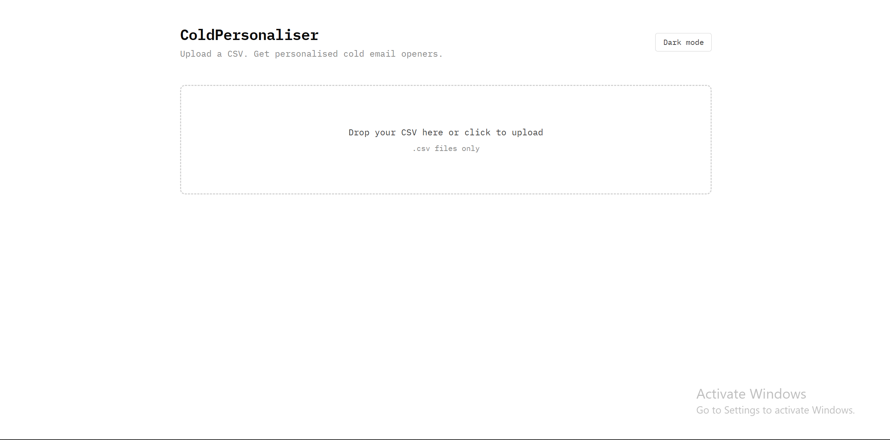
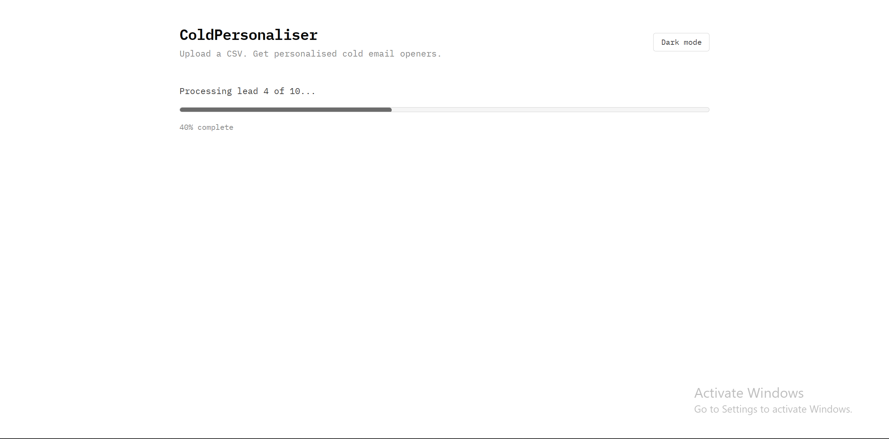
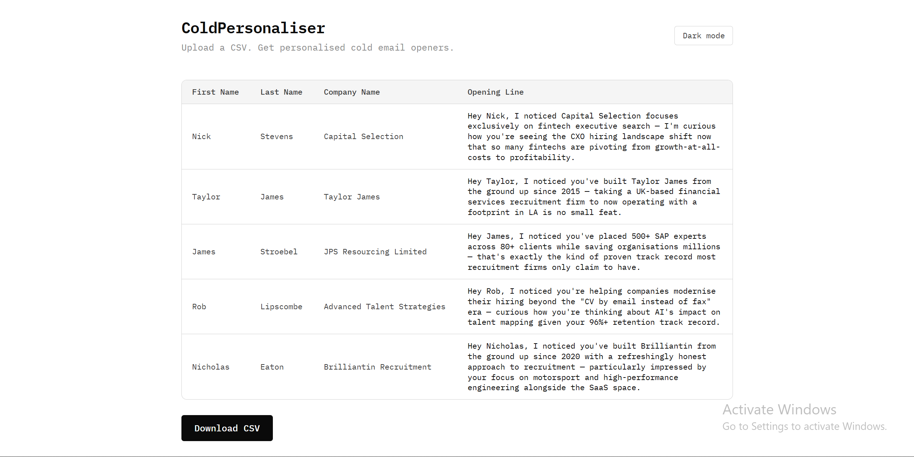
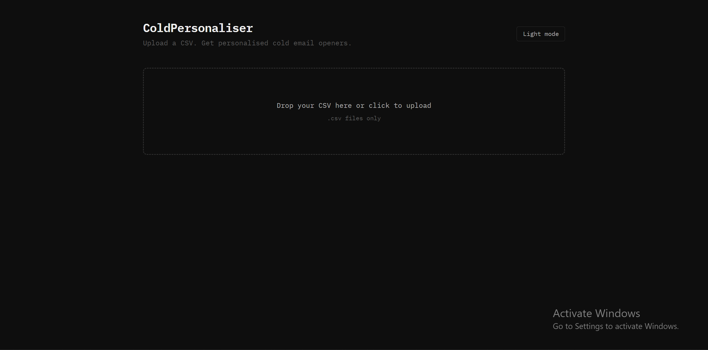
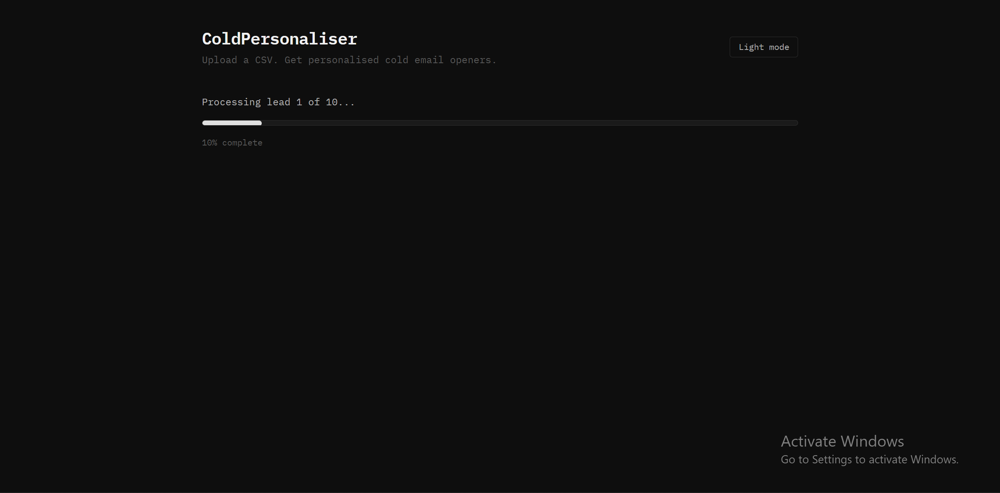
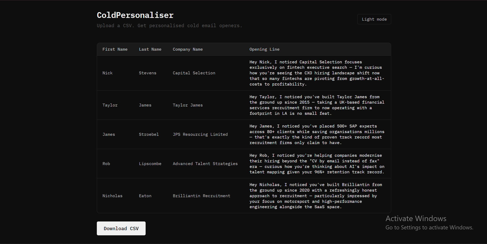

# ColdPersonaliser

AI-powered personalised cold email opening lines from any CSV of leads.

Built with FastAPI, React, and Claude (Anthropic).

---

## Screenshots

### Light Mode
| Upload | Processing | Results |
|---|---|---|
|  |  |  |

### Dark Mode
| Upload | Processing | Results |
|---|---|---|
|  |  |  |

---

## What It Does

Upload any CSV of leads. ColdPersonaliser sends each row to Claude AI which writes a unique, natural-sounding personalised opening line per cold email. Results stream in live as each line is generated. When done, download a new CSV with all your original columns intact plus a new `personalised_line` column appended at the end.

---

## Features

- **Any CSV** — no fixed column schema required. Works with exports from Apollo, LinkedIn Sales Navigator, or any lead source
- **Live progress** — lines stream in one by one via Server-Sent Events as Claude processes each lead
- **Original columns preserved** — output CSV is identical to input with one new column added
- **Light and dark mode** — toggleable, persisted to localStorage
- **Rate limiting and retries** — 0.5s delay between calls, exponential backoff on 429 errors

---

## Tech Stack

| Layer | Technology |
|---|---|
| Backend | Python 3.11+, FastAPI, Uvicorn |
| Frontend | React 18, Vite, Tailwind CSS |
| AI | Anthropic Claude (claude-sonnet-4-5) |
| Data | pandas |
| Streaming | Server-Sent Events (SSE) |

---

## Getting Started

### Requirements

- Python 3.11+
- Node.js 18+
- Anthropic API key — get one at [console.anthropic.com](https://console.anthropic.com)

### Backend

```bash
cd backend
python -m venv venv
source venv/bin/activate   # Windows: venv\Scripts\activate
pip install -r requirements.txt
cp .env.example .env
# Open .env and add your ANTHROPIC_API_KEY
uvicorn main:app --reload
```

Backend runs at `http://localhost:8000`

### Frontend

```bash
cd frontend
npm install
npm run dev
```

Frontend runs at `http://localhost:5173`

---

## Input CSV Format

No fixed schema — any CSV works as long as it contains useful contact or company information. The more context per row (name, role, company, headline, description), the better the generated lines.

Example columns that produce strong results:
- First Name, Last Name
- Company Name, Title, Industry
- Headline (LinkedIn headline)
- Company Short Description

---

## Output

The downloaded CSV will have all your original columns exactly as uploaded, with one new column appended:

| Column | Description |
|---|---|
| `personalised_line` | AI-generated opening line for that lead |

---

## Project Structure

```
coldpersonaliser/
├── backend/
│   ├── main.py                  # FastAPI app, CORS config
│   ├── routes/personalise.py    # POST /personalise — SSE streaming endpoint
│   ├── services/
│   │   ├── claude_service.py    # Claude API calls, prompt construction, retry logic
│   │   └── csv_service.py       # CSV parsing and output generation
│   ├── utils/rate_limiter.py    # Delay and exponential backoff helpers
│   ├── .env.example
│   └── requirements.txt
└── frontend/
    └── src/
        ├── App.jsx
        └── components/
            ├── UploadArea.jsx
            ├── PreviewTable.jsx
            ├── ProgressIndicator.jsx
            ├── ResultsTable.jsx
            └── DownloadButton.jsx
```

---

## Environment Variables

| Variable | Description |
|---|---|
| `ANTHROPIC_API_KEY` | Your Anthropic API key |

Copy `.env.example` to `.env` in the backend directory and fill in your key. Never commit `.env` to version control.
